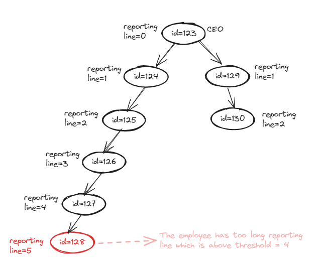

# Table of Contents

- [Problem Statement](#problem-statement)
- [Solution](#solution)
    - Short explanation
    - Running the project
    - Output example
- [Notes](#notes)

## Problem Statement

BIG COMPANY is employing a lot of employees. Company would like to analyze its organizational
structure and identify potential improvements. Board wants to make sure that every manager earns
at least 20% more than the average salary of its direct subordinates, but no more than 50% more
than that average. Company wants to avoid too long reporting lines, therefore we would like to
identify all employees which have more than 4 managers between them and the CEO.

You are given a CSV file which contains information about all the employees. File structure looks like
this:

```
Id,firstName,lastName,salary,managerId
123,Joe,Doe,60000,
124,Martin,Chekov,45000,123
125,Bob,Ronstad,47000,123
300,Alice,Hasacat,50000,124
305,Brett,Hardleaf,34000,300
```

Each line represents an employee (CEO included). CEO has no manager specified. Number of rows
can be up to 1000

The project will read the file and report:

- which managers earn less than they should, and by how much
- which managers earn more than they should, and by how much
- which employees have a reporting line which is too long, and by how much

## Solution

- After getting the employee list as a .csv file, the file is being parsed by `EmployeeFileParser` and all employees
  stored in a **HashMap**. HashMap data structure is selected to easily(With O(1) Complexity) reach the manager from the
  employee. So we can able to create organizational structure and define reporting lines of each employee.
- `EmployeeReportGenerator` is used to generate report with required information
    - It uses `EmployeeOrganizer` to prepare direct subordinates and reporting lines for employees.
    - It finds the less earner and more earner managers by calculating the average of direct subordinates salaries.
        - `MIN_SALARY_THRESHOLD_RATIO(default 0.2)` and `MAX_SALARY_THRESHOLD_RATIO(default 0.5)` static fields are used
          to determine less or more earners.
    - It finds the employees which has too long reporting lines between them and the CEO.
        - `REPORT_LINE_THRESHOLD(default 4)` static field is used to determine the reporting line threshold.
        - 
    - It uses `ReportWriter` to print out the report data to console.

### Running the project

- The `Main.main()` method can be used to run the project with the sample `employees.csv` file under the resources
  folder.

### Output Example

```
--Manager list which earn less than 20.00% the average salary of its direct subordinates--
Manager Id, First Name, Last Name, Salary, Average Sub Ordinates Salary, Diff From Average(Ratio), How Much Less Earning Than Required(Amount)
130, Harry, Longman, 62,000.00, 56,666.67, 9.41%, -6,000.00
134, Jake, Shortman, 37,000.00, 87,000.00, -57.47%, -67,400.00
135, Fred, Nina, 68,000.00, 72,000.00, -5.56%, -18,400.00
136, Elizabeth, Nouman, 48,000.00, 74,000.00, -35.14%, -40,800.00
138, Nancy, Clement, 84,000.00, 91,000.00, -7.69%, -25,200.00
140, Julian, Rob, 39,000.00, 47,000.00, -17.02%, -17,400.00
124, Martin, Chekov, 45,000.00, 62,500.00, -28.00%, -30,000.00
125, Bob, Ronstad, 47,000.00, 59,500.00, -21.01%, -24,400.00
127, Lucy, Smith, 50,000.00, 45,000.00, 11.11%, -4,000.00

--Manager list which earn more than 50.00% the average salary of its direct subordinates--
Manager Id, First Name, Last Name, Salary, Average Sub Ordinates Salary, Diff From Average(Ratio), How Much More Earning Than Required(Amount)
139, April, Soft, 91,000.00, 60,000.00, 51.67%, 1,000.00

--Employees which have more than 4 managers between them and the CEO--
Employer Id, First Name, Last Name, Reporting Line Until CEO
139, April, Soft, 5
140, Julian, Rob, 6
145, William, Hunter, 7
146, Grace, Martin, 6
```

## Notes

- **Mocking in unit test:** Because it is mentioned that no dependencies other than Junit should be used in the
  exercise requirement, mockito library is not added into the project. Mocking is simulated using the anonymous class in
  the `EmployeeReportGeneratorTest` unit test class. 